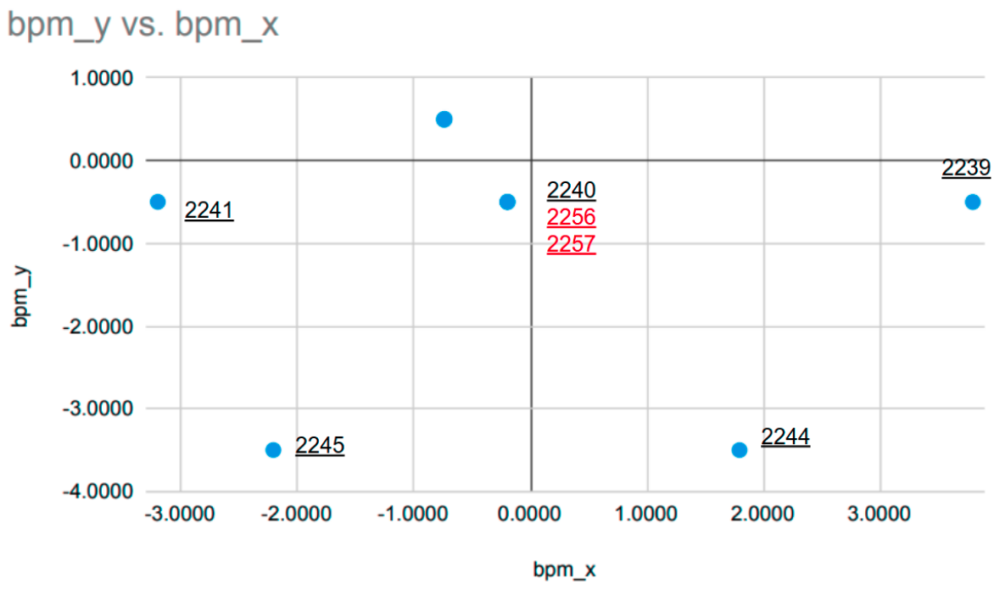

# spectrometer_nn
HRS Spectrometer Neural Network Calibration method

## Prepare the Source Data
### Data source Introduction
The script take the output of the Opt scripts output root file as input. There are two different type of root files

- [focal plane dataset](./dataGenerator/data/data_focal). focal plane training dataset
- [detector plane dataset](./dataGenerator/data/data_detCoord) detector plane training dataset

The **[focal plane dataset](./dataGenerator/data/data_focal)** are comes from the focal plane dataset. The VDC database have been corrected and optimzied to (0,0,0). The preliminary Neural Network did not 
show good result. Probably the neural network still not trained to the best situation or probably, we did not do the vdc focal plane constant correctly. 

Another way to do the training would be take the data on the detector plane as the feature directly. In this case, would ignore the mistake(if there is any) when do the vdc constant correction. [detector plane dataset](./dataGenerator/data/data_detCoord) 
are the root files contains the detector plane variables. 

**ATTENTION: to make the code work for all, did not change the name in the rootfile or in the training dataset.**

<a align='center'><h3>Table of runList</h3> </a>

| Dp Scan | run  | focal\_x  | focal\_th | focal\_y  | focal\_ph | bpm\_x   | bpm\_y   |
| ------- | ---- | --------- | --------- | --------- | --------- | -------- | -------- |
| 0       | 2239 | \-0.01362 | \-0.00069 | 0.00069   | \-0.00506 | 3.7944   | \-0.5007 |
| 0       | 2240 | \-0.0134  | \-0.00054 | \-0.00421 | \-0.0061  | \-0.2004 | \-0.4996 |
| 0       | 2241 | \-0.01366 | \-0.00063 | \-0.00774 | \-0.00706 | \-3.2000 | \-0.4986 |
| 0       | 2244 | \-0.0206  | 0.00114   | \-0.00194 | \-0.00549 | 1.7921   | \-3.4975 |
| 0       | 2245 | \-0.02082 | 0.00116   | \-0.00678 | \-0.00692 | \-2.2083 | \-3.4970 |
| 1       | 2256 | \-0.14708 | \-0.00134 | \-0.0065  | \-0.00796 | \-0.1973 | \-0.4995 |
| \-1     | 2257 | 0.11953   | 0.00047   | \-0.00197 | \-0.00442 | \-0.2005 | \-0.4984 |

<a align='center'><h3>Beam Postion of Each Run</h3> </a>

[[Read more]](./dataGenerator)

### Load Dataset

| dataset | Coord | Intro                                                                                    | baseDir                                                                       |
| ------- | ----- | ---------------------------------------------------------------------------------------- | ----------------------------------------------------------------------------- |
| 1       | focal | \- focal plane coord \- only x,y,theta,phi \- used for Deep Neural Network | [homeserve](http://216.197.71.44/Data/spectro_nn/focalPlane/EqEvt731/order0/) |

## TODO
 - [x] Change unequal dataset ? The number of the dataset in each sieve hole will reflect the importance of the sieve hole
   - [x] tested bad
 - [x] Try Detector Coordination System different order optimize
   - [ ] 3 order
   - [ ] 4 order
   - [ ] 5 order
 - [ ] add new tune function to the multi-order training
<!-- LICENSE -->
## License

Distributed under the MIT License. See `LICENSE` for more information.

# Contact
## [Siyu Jian]()

[comment]: <> (<a href="https://github.com/markdown-templates/markdown-snippets/stargazers">)

[comment]: <> ()

[comment]: <> (</a>)

