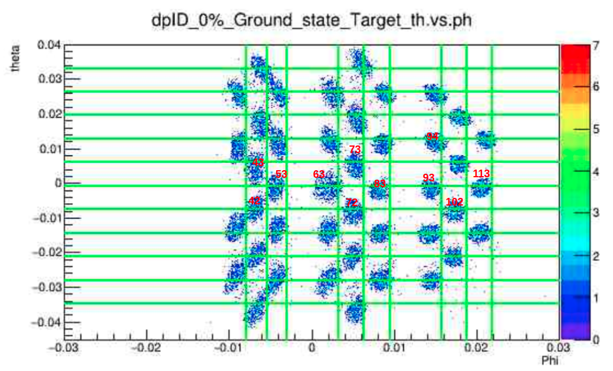

*******************************************
```{r config, echo=FALSE}
source(system.file("config/hw_config.R", package="R6018")) # knitr settings
# options(dplyr.summarise.inform = FALSE)  # ignore dplyr message about grouping
```


# Required R packages and Directories

### {.solution}
```{r packages, message=FALSE, warning=FALSE}
data.dir = 'https://mdporter.github.io/SYS6018/data/' # data directory
library(R6018)     # functions for SYS-6018
library(tidyverse) # functions for data manipulation   
library(mlbench)
library(glmnet)
library(glmnetUtils) 
```
# Load the focal plane training dataset


```{r message=FALSE, warning=FALSE, cache=TRUE}
focal_url = "http://localhost/Data/spectro_nn/focalPlane/Equal/EqEvt731/order10_ep5/combine.csv" 
data_focal = readr::read_csv(focal_url)

data_focal$focal_x  = data_focal$x1th0y0ph0
data_focal$focal_th = data_focal$x0th1y0ph0
data_focal$focal_y  = data_focal$x0th0y1ph0
data_focal$focal_ph = data_focal$x0th0y0ph1
# head(data_focal)
```

# check the focal plane $\phi$ parameter

```{r message=FALSE, warning=FALSE}
runList = c(2239,2240,2241)
result.ph = tibble(runID = numeric(), index = numeric(), aver_X = numeric(), aver_Y = numeric())

colors <- c("col.4"="black", "col.6"="red", "col.7"="blue")

myplots <- list()  # new empty list
for (indexID in 1:length(runList)){
  runID.step = runList[indexID] 
  
  data.step = data_focal %>% filter(runID == runID.step)  %>% filter(SieveColID == 4 | SieveColID == 6 | SieveColID == 7)
  data63 = data.step %>% filter(SieveColID == 6 & SieveRowID == 3)
  center.63 =  tibble(x= mean(data63$focal_ph), y = mean(data63$focal_th))
  
  data42 = data.step %>% filter(SieveColID == 4 & SieveRowID == 2)
  center.42 =  tibble(x= mean(data42$focal_ph), y = mean(data42$focal_th))
  data72 = data.step %>% filter(SieveColID == 7 & SieveRowID == 2)
  center.72 = tibble(x= mean(data72$focal_ph), y = mean(data72$focal_th))

  result.ph = add_row(result.ph,tibble(runID = runID.step, index = 63, aver_X = center.63$x, aver_Y = center.63$y))
  result.ph = add_row(result.ph,tibble(runID = runID.step, index = 42, aver_X = center.42$x, aver_Y = center.42$y))
  result.ph = add_row(result.ph,tibble(runID = runID.step, index = 72, aver_X = center.72$x, aver_Y = center.72$y))
  
  myp = ggplot(data.step) + geom_bin2d(aes(x=focal_ph,y=focal_th,color = sprintf("col.%d",SieveColID)),bins=300) + geom_point(data = center.63, aes(x= x , y =y , color = "data.63")) +
    geom_point(data = center.42, aes(x= x , y =y , color = "data.43")) +
    geom_point(data = center.72, aes(x= x , y =y , color = "data.72")) +
    xlim(-0.025,0.02) +  ylim(-0.025,0.02) +  ggtitle(sprintf("LHRS run %d",runID.step)) 
  myplots[[indexID]] = myp
}

myplots[1]
myplots[2]
myplots[3]

result.ph %>% filter(index == 63)%>%knitr::kable()
result.ph %>% filter(index == 42)%>%knitr::kable()
result.ph %>% filter(index == 72)%>%knitr::kable()
```


```{r}
runList = c(2239,2240,2241)
result.y = tibble(runID = numeric(), index = numeric(), aver_X = numeric(), aver_Y = numeric())
colors <- c("col.4"="black", "col.6"="red", "col.7"="blue")
myplots <- list()  # new empty list
for (indexID in 1:length(runList)){
  runID.step = runList[indexID] 
  
  data.step = data_focal %>% filter(runID == runID.step) %>% filter(SieveColID == 4 | SieveColID == 6 | SieveColID == 7)
  
  data63 = data.step %>% filter(SieveColID == 6 & SieveRowID == 3)
  center.63 =  tibble(x= mean(data63$focal_y), y = mean(data63$focal_th))
  
  data42 = data.step %>% filter(SieveColID == 4 & SieveRowID == 2)
  center.42 =  tibble(x= mean(data42$focal_y), y = mean(data42$focal_th))
  data72 = data.step %>% filter(SieveColID == 7 & SieveRowID == 2)
  center.72 = tibble(x= mean(data72$focal_y), y = mean(data72$focal_th))

  result.y = add_row(result.y,tibble(runID = runID.step, index = 63, aver_X = center.63$x, aver_Y = center.63$y))
  result.y = add_row(result.y,tibble(runID = runID.step, index = 42, aver_X = center.42$x, aver_Y = center.42$y))
  result.y = add_row(result.y,tibble(runID = runID.step, index = 72, aver_X = center.72$x, aver_Y = center.72$y))
  
  myp = ggplot(data.step) + geom_bin2d(aes(x=focal_y,y=focal_th,color = sprintf("col.%d",SieveColID)),bins=300) + geom_point(data = center.63, aes(x= x , y =y , color = "data.63")) +
    geom_point(data = center.42, aes(x= x , y =y , color = "data.43")) +
    geom_point(data = center.72, aes(x= x , y =y , color = "data.72")) +
    xlim(-0.025,0.02) +  ylim(-0.025,0.02) +  ggtitle(sprintf("LHRS run %d",runID.step)) 
  myplots[[indexID]] = myp
}

myplots[1]
myplots[2]
myplots[3]

result.y %>% filter(index==63) %>% knitr::kable()
result.y %>% filter(index==42) %>% knitr::kable()
result.y %>% filter(index==72) %>% knitr::kable()
```

# Check All **Y** and $\phi$ Parameters

**Sieve ID name rule **


## focal $\phi$ and $Y$ Parameters 

```{r message=FALSE, warning=FALSE}
runList = c(2239, 2240, 2241)
sieveList = c(42,53,63,72,83,93,102,113)

result.sieve = tibble(runID = runID.step,index = numeric(),aver_focal_ph = numeric(),aver_focal_th = numeric(),aver_focal_x = numeric(),
                      aver_focal_y = numeric(),theor_targ_th = numeric(), theor_targ_ph = numeric())
focal.ph.plot <- list()
focal.y.plot <- list()
targ.plot <- list()

for (indexID in 1:length(runList)) {
  runID.step = runList[indexID]
  # prepare the data
  data.step = data_focal %>% filter(runID == runID.step)
  data.step$colIndexer = sprintf("col.%d",data.step$SieveColID)
  for(sieveIndex in 1:length(sieveList)){
    rowID = sieveList[sieveIndex]%%10
    colID = sieveList[sieveIndex]%/%10
    
    #load the dataset and write the information to the buffer
    # project the focal and target varaibles
    data.step.sieve = data.step %>% filter(SieveColID == colID & SieveRowID == rowID)
    sieve.mean = tibble(runID = runID.step, index = sieveList[sieveIndex],aver_focal_ph = mean(data.step.sieve$focal_ph),aver_focal_th = mean(data.step.sieve$focal_th),aver_focal_x = mean(data.step.sieve$focal_x), aver_focal_y = mean(data.step.sieve$focal_y),theor_targ_th = mean(data.step.sieve$targCalTh), theor_targ_ph= mean(data.step.sieve$targCalPh))
    result.sieve = add_row(result.sieve,sieve.mean)
  }  
  myp.th = ggplot(data.step) + geom_bin2d(aes(x=focal_ph,y=focal_th,color = colIndexer),bins=300) + geom_point(data = result.sieve%>% filter(runID == runID.step), aes(x= aver_focal_ph , y =aver_focal_th , color = "red")) +
    xlim(-0.025,0.02) +  ylim(-0.025,0.02) +  ggtitle(sprintf("LHRS run %d",runID.step)) 
  focal.ph.plot[[indexID]] = myp.th

  myp.y = ggplot(data.step) + geom_bin2d(aes(x=focal_y,y=focal_th,color = colIndexer),bins=300) + geom_point(data = result.sieve%>% filter(runID == runID.step), aes(x= aver_focal_y , y =aver_focal_th , color = "red")) +
    xlim(-0.025,0.02) +  ylim(-0.025,0.02) +  ggtitle(sprintf("LHRS run %d",runID.step)) 
  focal.y.plot[[indexID]] = myp.y
  
  myp.targ = ggplot(data.step) + geom_point(aes(x=targCalPh,y=targCalTh,color = colIndexer)) + 
    xlim(-0.025,0.025) +  ylim(-0.035,0.035) +  ggtitle(sprintf("LHRS run %d target Var",runID.step)) 
  targ.plot[[indexID]] = myp.targ
}


```
## target variable check 
```{r}
targ.plot[1]
targ.plot[2]
targ.plot[3]
```

## $\phi$ result 
```{r warning=FALSE}

focal.ph.plot[1]
focal.ph.plot[2]
focal.ph.plot[3]

```

# Target Variable Check
```{r}
runList = c(2239,2240,2241)

data_focal %>% filter(runID == 2239 & SieveColID == 6 & SieveRowID == 3) %>% select(runID, SieveRowID, SieveColID,targCalTh,targCalPh) %>% head()

data_focal %>% filter(runID == 2240 & SieveColID == 6 & SieveRowID == 3) %>% select(runID, SieveRowID, SieveColID,targCalTh,targCalPh) %>% head()

data_focal %>% filter(runID == 2241 & SieveColID == 6 & SieveRowID == 3) %>% select(runID, SieveRowID, SieveColID,targCalTh,targCalPh) %>% head()


```


# Check the focal variable seperation 

## k-nearest neighbor

not suitable (?)

## check with the first order focal plane variables ($focal_{\theta} vs. focal_{\phi}$)

```{r}

runList = c(2239,2240,2241)
result.y = tibble(runID = numeric(), index = numeric(), aver_X = numeric(), aver_Y = numeric())
colors <- c("col.4"="black", "col.6"="red", "col.7"="blue")
myplots <- list()  # new empty list

for (indexID in 1:length(runList)){
  runID.step = runList[indexID] 
  
  data.step = data_focal %>% filter(runID == runID.step) %>% filter(SieveColID == 4 | SieveColID == 6 | SieveColID == 7)
  
  data63 = data.step %>% filter(SieveColID == 6 & SieveRowID == 3)
  center.63 =  tibble(x= mean(data63$focal_y), y = mean(data63$focal_th))
  
  data42 = data.step %>% filter(SieveColID == 4 & SieveRowID == 2)
  center.42 =  tibble(x= mean(data42$focal_y), y = mean(data42$focal_th))
  data72 = data.step %>% filter(SieveColID == 7 & SieveRowID == 2)
  center.72 = tibble(x= mean(data72$focal_y), y = mean(data72$focal_th))

  result.y = add_row(result.y,tibble(runID = runID.step, index = 63, aver_X = center.63$x, aver_Y = center.63$y))
  result.y = add_row(result.y,tibble(runID = runID.step, index = 42, aver_X = center.42$x, aver_Y = center.42$y))
  result.y = add_row(result.y,tibble(runID = runID.step, index = 72, aver_X = center.72$x, aver_Y = center.72$y))
  
  myp = ggplot(data.step) + geom_bin2d(aes(x=focal_y,y=focal_th,color = sprintf("col.%d",SieveColID)),bins=300) + geom_point(data = center.63, aes(x= x , y =y , color = "data.63")) +
    geom_point(data = center.42, aes(x= x , y =y , color = "data.43")) +
    geom_point(data = center.72, aes(x= x , y =y , color = "data.72")) +
    xlim(-0.025,0.02) +  ylim(-0.025,0.02) +  ggtitle(sprintf("LHRS run %d",runID.step)) 
  myplots[[indexID]] = myp
}

myplots[1]
myplots[2]
myplots[3]

result.y %>% filter(index==63) %>% knitr::kable()
result.y %>% filter(index==42) %>% knitr::kable()
result.y %>% filter(index==72) %>% knitr::kable()


# plot the focal plane


```

### Let plot the different runs on the same canvas, and compare with the value


```{r}
runList = c(2239,2240,2241)
result.y = tibble(runID = numeric(), index = numeric(), aver_X = numeric(), aver_Y = numeric())
colors <- c("col.4"="black", "col.6"="red", "col.7"="blue")
myplots <- list()  # new empty list


data.focal_all = data_focal %>% 
  filter(runID == 2239 | runID == 2240 | runID == 2241) %>% 
  filter(SieveColID == 4 | SieveColID == 6 | SieveColID == 7)

data.focal_all %>% head(50)

#plot the runs

plot.res.focal_check = ggplot(data.focal_all) +
  geom_bin2d(aes(x=focal_y,y=focal_th,color = sprintf("run.%d",runID)),bins=300) +
  xlim(-0.025,0.02) +  ylim(-0.025,0.02) +  ggtitle(sprintf("LHRS run %d %d %d",2239,2240,2241))

plot.res.focal_check
```

## check 
```{r}

# idea : group by the ID, and get the average of each focal plane variables

data.average_focal = data_focal  %>% 
  filter(runID == 2239 | runID == 2240 | runID == 2241) %>% 
  filter(SieveColID == 4 | SieveColID == 6 | SieveColID == 7) 


data.average_focal$UID <- data.average_focal$runID * 1000 + data.average_focal$CutID
data.average_focal %>% select(evtID, runID,CutID, SieveRowID, SieveColID, UID) %>% head(50)


# group by the UID and get the average


# get the average value of all the parameters

data.average_focal_selected = aggregate(data.average_focal[,],list(data.average_focal$UID),mean)

data.average_focal_selected %>% head(100)


data.final_dataset = data.average_focal_selected %>% select(focal_x, focal_y,focal_th,focal_ph) %>% scale()
dX = dist(data.final_dataset,method = "euclidean")
hc.centroid = hclust(dX,method = "centroid")   
plot(hc.centroid,sub="centroid")

```

